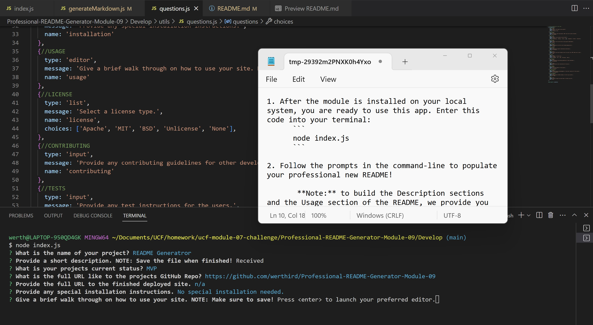

<header style="height: 100px; background: linear-gradient(to right, #6268f2, #23d0ee);"><h1 style="font-size: 65px; text-align: center"><strong>README Generator</strong></h1></header>

<br />

[](#license)


<br />

> # [Description](#description)
After you have worked your butt of to complete of a beautiful, but long project, what is one of the last things you want to foget about? Producing that sweet looking README file to showcase your code. README's are so important to the professionality of your code as this is the first thing anyone see. A sloppy README showcases sloppy code.

Our command-line Professional README Generator helps you show that your amazing README, is just a taste of how good your code looks. After taking you through some simple command-line prompts, our application quickly and easily creates that README that you have always wanted.

<br />
<br />

---
<details>
<summary style="font-size: 25px">Table of Contents</summary> 

- [Description](#description)
- [Getting Started](#getting-started)
  - [Project Status](#project-status)
  - [Installation](#installation)
  - [Useage](#useage)
  - [Contributing Guidelines](#contributing)
  - [Test Instructions](#test) 
  - [License](#license)
- [Credits](#credits)
  - [Contributors](#contributors)
  - [Acknowledgements](#acknowledgements)
- [Questions](#questions)
</details>

<br />
<br />

---

> # [Getting Started](#getting-started)

<br />

## [Project Status](#project-status)
    MVP - Minimal Viable Product

To get a look at the code used for this application, checkout our my <a href="https://github.com/werthird/Professional-README-Generator-Module-09">GitHub Repo!</a> 

<br />

*Click on this [**LINK**](https://drive.google.com/file/d/1pgNIsay2YsOpGeCvZEuselizqn6VNUgK/view?usp=sharing) to get a walk through video of how to use the application.*

<br />

## [Installation](#installation)
If you are wanting to use this application on your own system, you will need to know a few things:

1.  This is a command-line application. It uses the NPM Module [**Inquirer.js**](https://www.npmjs.com/package/inquirer?activeTab=readme). Please follow this link to read about it: 

2. Clone down this repo onto your local system.

3. After doing so, open a terminal in the Professional-README-Generator-Module-09 file, and enter the following code:
	```
	npm i
	```

<br />

## [Useage](#useage)
This is a command-line application that will take you through a series of prompt to build the README.

1. After the module is installed on your local system, you are ready to use this app. Enter this code into your terminal:
	```
	node index.js
	```

2. Follow the prompts in the command-line to populate your professional new README!
   
	 **Note:** to build the Description sections and the Usage section of the README, we provide you with a text editor, so you can build out more information. Sometimes this text editor doesn't pop-up right away. Look on your task bar to locate it. 
	 
	 When you are finished, press the close button and make sure to select SAVE! This won't save to your device, rather it will save it to the terminal so it can be added to the README.

<br />

*Click on this [**LINK**](https://drive.google.com/file/d/1pgNIsay2YsOpGeCvZEuselizqn6VNUgK/view?usp=sharing) to get a walk through video of how to use the application.*

<br />



<br />

## [Contributing Guidelines](#contributing)
No contributing guidelines. For any suggestions or comments, please see [Questions](#questions) section below.

<br />

## [Test Instructions](#test)
No specified test instructions.

<br />

## [License](#license)
Distributed under the MIT License. See LICENSE.txt for more information.

<br />
<br />

---

> # [Credits](#credits)

<br />

## [Contributors](#contributors)
This is a UCF Coding bootcamp homework assignment. There was some pre-written code that had to be finished and formulated to meet the assignments requirements.

Finished by yours truly: Devin Reilly

<br />

## [Acknowledgements](#acknowledgements)
- UCF GitLab starter code
- [The Full-Stack Blog](https://coding-boot-camp.github.io/full-stack/github/professional-readme-guide) - README Template 
- UCF Instructor **John Dinsmore**, and TA's, **Kristofer Marshall** and **Rider Cogswell**
- Students of UCF Coding Boot Camp, in class, on Slack and on Discord
- Research articles from Google Search, ChatGPT, MDN Docs, W3Schools

<br />
<br />

---

> # [Questions](#questions)

Here is a link to our <a href="https://github.com/werthird">GitHub profile page!</a>

Or send us an <a href="mailto: werthird@aol.com?subject=README Generator Feedback">Email!</a>
